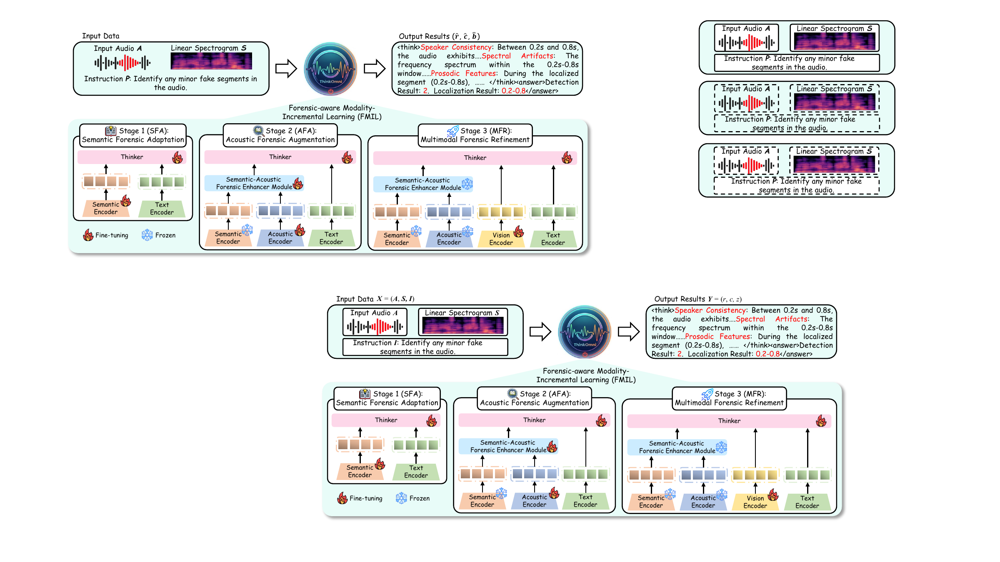

# ThinkOmni

### A Reasoning-Driven Omni-Modal LLM Framework for Audio Forgery Detection and Localization

[](https://beyond0814.github.io/ThinkOmni/)
[](#release-status)
[](#release-status)
[](#release-status)

ThinkOmni is a reasoning-driven omni-modal large language model for unified audio forgery reasoning, spoofing detection, and temporal manipulation localization. It combines semantic, acoustic, and spectral-visual evidence to make forensic predictions more explicit and transferable across datasets.

<p align="center">
  
</p>

## Highlights

- **ThinkOmni** jointly produces an inspectable forensic rationale, a three-class authenticity prediction, and one or more manipulated time intervals.
- **FACoT** contains 100K samples with structured reasoning annotations grounded in semantic inconsistencies, acoustic artifacts, and temporal manipulation patterns.
- **FMIL** progressively aligns semantic, acoustic, and spectral-visual representations while reducing interference between modalities.
- **FCML** balances reasoning, detection, and localization objectives with role-aware token weighting and adaptive boundary supervision.
- ThinkOmni reaches **93.70% / 93.72%** average intra-dataset ACC / F1 and **80.74% / 85.15%** average cross-dataset ACC / F1. For localization, it achieves **88.05%** intra-dataset mAP and **74.67%** cross-dataset mAP.

## Release Status

The project page is available now. Paper, code, checkpoints, FACoT annotations, and inference examples are being prepared for public release.

| Resource | Status |
| --- | --- |
| Project page | Available |
| Paper and supplementary material | Coming soon |
| Training and inference code | Coming soon |
| Model checkpoints | Coming soon |
| FACoT annotations | Coming soon |

## Citation

```bibtex
@misc{xu2026thinkomni,
  title  = {ThinkOmni: A Reasoning-Driven Omni-Modal LLM Framework for Audio Forgery Detection and Localization},
  author = {Yuxiong Xu and Kaiqing Lin and Bin Li and Haodong Li and Sheng Li},
  year   = {2026}
}
```

## Acknowledgements

ThinkOmni is built on [Qwen2.5-Omni](https://github.com/QwenLM/Qwen2.5-Omni), [Wav2Vec2 XLS-R](https://huggingface.co/facebook/wav2vec2-xls-r-300m), and [ms-swift](https://github.com/modelscope/ms-swift). We thank the authors of these projects and the public audio-forensics benchmarks used in FACoT.
