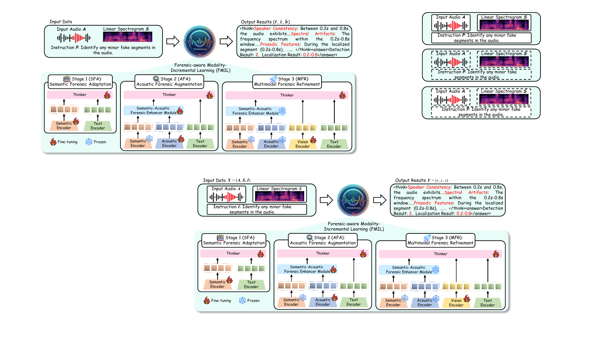

<div align="center">

# ThinkOmni

### A Reasoning-Driven Omni-Modal LLM Framework<br>for Audio Forgery Detection and Localization

[](https://beyond0814.github.io/ThinkOmni/)
[](#release-status)
[](#release-status)
[](#release-status)

</div>

ThinkOmni is a reasoning-driven omni-modal large language model for unified **audio forgery reasoning, spoofing detection, and temporal manipulation localization**. It combines semantic, acoustic, and spectral-visual evidence to make forensic predictions more explicit and transferable across datasets.

<p align="center">
  
</p>

## Highlights

- **ThinkOmni** jointly produces an inspectable forensic rationale, a three-class authenticity prediction (fully real, fully fake, or partially fake), and manipulated time intervals when present.
- **FACoT · Forensic-Aware Chain-of-Thought** contains 100K samples with structured reasoning annotations grounded in semantic inconsistencies, acoustic artifacts, and temporal manipulation patterns.
- **FMIL · Forensic-Aware Modality-Incremental Learning** progressively aligns semantic, acoustic, and spectral-visual representations while reducing interference between modalities.
- **FCML · Forensic-Consistent Multi-task Loss** balances reasoning, detection, and localization objectives with role-aware token weighting and adaptive boundary supervision.

## Results

ThinkOmni achieves the following results under the evaluation protocols described in the paper. All values are percentages; higher is better.

| Evaluation | Average ACC ↑ | Average F1 ↑ | mAP ↑ |
| :--- | ---: | ---: | ---: |
| Intra-dataset | **93.70** | **93.72** | **88.05** |
| Cross-dataset | **80.74** | **85.15** | **74.67** |

## Code Overview

The core implementation is in `src/q25o_xlsr_cross_attn/` and is registered with ms-swift as `qwen2_5_omni_xlsr`.

| Component | Function |
| :--- | :--- |
| `custom_model.py` | Registers the model/template, loads Qwen and XLS-R, and processes audio, images, and text. |
| `module/modeling_qwen2_5_omni.py` | Extracts XLS-R features and fuses them with Qwen audio features through cross-attention. |
| `module/processing_qwen2_5_omni.py` | Provides the multimodal processor and input conversion. |
| `custom_plugin.py` | Trains LoRA adapters and cross-attention parameters, and registers the optimizer. |
| `save_model.py` | Injects XLS-R weights into a Qwen checkpoint and verifies keys, shapes, and tensor values. |

The data flow is:

~~~text
audio + instruction ──> Qwen audio encoder ──┐
                                             ├──> Thinker ──> reasoning, detection, localization
audio ────────────────> XLS-R + cross-attn ──┘
spectrogram ──────────> vision encoder ──────┘  (Stage 3)
~~~

Build an XLS-R-enabled checkpoint with:

~~~bash
python src/q25o_xlsr_cross_attn/save_model.py \
  --base_model model/Qwen2.5-Omni-7B \
  --xlsr_path model/wav2vec2-xls-r-300m \
  --save_path model/model_xlsr_base
~~~

Training uses LoRA for the selected multimodal layers and full-parameter updates for `cross_attn`. The loss configuration combines token-level reasoning supervision with detection and temporal-localization objectives.

## Training

Run every command from the repository root. The three stages must be executed in order.

### Stage 1: SFA — Qwen2.5-Omni fine-tuning

Stage 1 uses the Qwen2.5-Omni implementation provided in the local `src/msswift/` directory. Install this copy in editable mode before training so the local loss and template changes are used:

~~~bash
pip install -e src/msswift
export PYTHONPATH="$PWD/src/msswift:$PWD/src:$PYTHONPATH"
~~~

#### Configure the fine-tuned modules

Before Stage 1, set the Qwen2.5-Omni entry in [model_arch.py](src/msswift/swift/model/model_arch.py) to the following configuration. This checkout already contains it; keep only one active registration for this model.

```python
register_model_arch(
    MultiModelKeys(
        MLLMModelArch.qwen2_5_omni,
        language_model=['thinker.model', 'thinker.lm_head'],
        vision_tower=['thinker.audio_tower', 'thinker.visual'],
        aligner=['thinker.audio_tower.proj', 'thinker.visual.merger'],
        generator=['talker', 'token2wav'],
    ))
```

The registration defines module groups. The training flags then select which groups are eligible for adaptation:

| Group | Modules | Stage 1 setting |
| :--- | :--- | :--- |
| Language model | Thinker decoder and language head | `--freeze_llm false` |
| Encoders | Audio tower and visual encoder | `--freeze_vit false` |
| Alignment | Audio projection and visual merger | `--freeze_aligner false` |
| Speech generation | Talker and token-to-waveform modules | Excluded from the LoRA target groups |

Use these arguments in [train_stage1_SFA.sh](trainer/train_stage1_SFA.sh):

```bash
--train_type lora \
--target_modules all-linear \
--freeze_llm false \
--freeze_vit false \
--freeze_aligner false \
--lora_rank 8 \
--lora_alpha 32
```

With LoRA, these flags enable adapters on eligible linear layers; they do not unfreeze every base-model parameter. The local target selector excludes the standalone `lm_head` from automatic `all-linear` matching. Audio-only SFA does not exercise the visual branch, even when that branch is eligible for adaptation. Check the resolved target modules, trainable-parameter log, and gradients after the first backward pass to confirm the intended modules receive updates.

#### Configure the loss

The loss implementation is part of the local ms-swift package, not `custom_plugin.py`. The latter registers the Stage 2 tuner and optimizer.

| File | Responsibility |
| :--- | :--- |
| [loss/psd.py](src/msswift/swift/loss/psd.py) | Weighted cross-entropy and optional temporal localization loss |
| [loss/mapping.py](src/msswift/swift/loss/mapping.py) | Maps `psd_detection_localization` to `PSDDetectionLocalizationLoss` |
| [loss_scale/psd.py](src/msswift/swift/loss_scale/psd.py) | Splits the response into reasoning, detection, and localization segments |
| [loss_scale/config/psd.json](src/msswift/swift/loss_scale/config/psd.json) | Sets segment and detection-class weights |
| [loss_scale/mapping.py](src/msswift/swift/loss_scale/mapping.py) | Maps `psd_think_det_loc` to `PSDThinkDetLocLossScale` |

Enable both options together:

```bash
--loss_type psd_detection_localization \
--loss_scale psd_think_det_loc
```

**Response format.** Use `<think>...</think>` for reasoning supervision. The current segment parser does not recognize a plain `Reasoning:` heading as the reasoning segment.

```text
<think>Evidence supporting the prediction.</think>
Detection Result: 2
Localization Result: 0.43-1.36
```

Labels are `0 = fully real`, `1 = fully fake`, and `2 = partially fake`; the parser also accepts these text labels.

**Weighted cross-entropy.** The implementation sums token cross-entropies multiplied by their segment weights and divides by the sum of weights at valid label positions (`labels != -100`, after causal shifting). The trainer shifts `loss_scale` before passing it to the loss; do not shift it again.

| Segment | Current effective token weight | Environment override |
| :--- | :--- | :--- |
| Reasoning | 0.2 | `PSD_WEIGHT_THINK` |
| Detection: fully real | 0.2 × 0.36 = 0.072 | `PSD_DETECTION_SCALE` changes the 0.2 factor |
| Detection: fully fake | 0.2 × 0.24 = 0.048 | Same |
| Detection: partially fake | 0.2 × 0.40 = 0.080 | Same |
| Localization text | 0.6 | `PSD_WEIGHT_LOCALIZATION` |

Class weights are read from `psd.json`. These configured values are not inverse-frequency weights, despite the comment in the Python class.

**Optional interval loss.** If the forward output supplies differentiable `localization_pred` and target `localization_gt` tensors of shape `[B, 2]`, the loss adds:

```text
L = weighted_CE + PSD_IOU_WEIGHT × auxiliary_loss

partially fake: 0.5 × (1 − temporal_IoU) + 0.5 × SmoothL1(boundaries)
fully real:    0.3 × SmoothL1(predicted_boundaries, zeros)
fully fake:    no additional interval penalty
```

`PSD_IOU_WEIGHT` defaults to `0.5`. Class-specific behavior requires `detection_label` of shape `[B]`; without it, the interval loss is applied to all supplied intervals. If either localization tensor is missing, or the coefficient is nonpositive, training uses weighted cross-entropy only. The current custom model file does not emit these extra fields, so selecting the loss alone does not activate the interval term. Implement and return these tensors through the forward output before claiming interval-loss training; decoded timestamp strings are not a differentiable substitute. This auxiliary interface handles one interval per sample, while the text target can contain multiple intervals.


Prepare Stage 1 as follows:

1. Place Qwen2.5-Omni-7B under `model/Qwen2.5-Omni-7B/`.
2. Check the audio paths in `data/train_100k_think.json`.
3. Use `data/think_prompt.text` as the system prompt.
4. Confirm the PSD loss registration in `src/msswift/swift/loss/` and `src/msswift/swift/loss_scale/`.
5. Set GPU IDs and process count in `trainer/train_stage1_SFA.sh`.
6. Start training:

~~~bash
bash trainer/train_stage1_SFA.sh
~~~

The script uses `qwen2_5_omni`, LoRA, BF16, Flash-Attention, gradient checkpointing, `psd_detection_localization`, and `psd_think_det_loc`. Its default output is `result/Q25O7B_100k_Think_Stage1SFA/`.

The local ms-swift changes used by Stage 1 are:

| File | Purpose |
| :--- | :--- |
| `src/msswift/swift/loss/psd.py` | Joint detection and temporal-localization loss |
| `src/msswift/swift/loss/mapping.py` | Registers `psd_detection_localization` |
| `src/msswift/swift/loss_scale/psd.py` | Token-level loss weighting |
| `src/msswift/swift/loss_scale/mapping.py` | Registers `psd_think_det_loc` |
| `src/msswift/swift/model/models/qwen.py` | Qwen2.5-Omni loading and registration |
| `src/msswift/swift/template/templates/qwen.py` | Qwen2.5-Omni multimodal template |

### Stage 2: SFA + AFA — XLS-R and cross-attention

Stage 2 uses the custom implementation in `src/q25o_xlsr_cross_attn/`, separate from the standard Qwen2.5-Omni registration used in Stage 1.

Stage 2 must receive a checkpoint whose configuration already contains `thinker.xlsr` and `thinker.cross_attn`. A standard Stage 1 checkpoint cannot be passed directly unless it has first been converted to this custom architecture.

1. Download [Qwen2.5-Omni-7B](https://huggingface.co/Qwen/Qwen2.5-Omni-7B) and [Wav2Vec2-XLS-R-300M](https://huggingface.co/facebook/wav2vec2-xls-r-300m).
2. Place them under `model/Qwen2.5-Omni-7B/` and `model/wav2vec2-xls-r-300m/`.
3. Build the XLS-R-enabled checkpoint:

~~~bash
export PYTHONPATH="$PWD/src/q25o_xlsr_cross_attn:$PWD/src/msswift:$PWD/src:$PYTHONPATH"
python src/q25o_xlsr_cross_attn/save_model.py \
  --base_model model/Qwen2.5-Omni-7B \
  --xlsr_path model/wav2vec2-xls-r-300m \
  --save_path model/model_xlsr_base
~~~

4. Check `data/train_100k_think_linearspec.json` and use `data/think_prompt_mel.text`.
5. Confirm that `audios` and `images` resolve under the repository-relative `datasets/` directory.
6. Start training:

~~~bash
bash trainer/train_stage2_SFA_AFA.sh
~~~

This stage loads `custom_model.py` and `custom_plugin.py` through `external_plugins`, uses `qwen2_5_omni_xlsr` as both the model type and template, and selects the custom tuner and optimizer. The custom tuner trains LoRA parameters together with full-parameter `cross_attn` modules.

### Stage 3: SFA + AFA + MFR

Stage 3 starts from the Stage 2 checkpoint and adds spectrogram features through the vision branch:

~~~bash
bash trainer/train_stage3_SFA_AFA_MFR.sh
~~~

Use `data/train_100k_think_linearspec.json`, keep `images` aligned with `audios`, and set `MODEL_PATH` to the completed Stage 2 output when needed.

### Path overrides

The scripts resolve the repository root automatically. Override paths without editing machine-specific locations:

~~~bash
MODEL_PATH=model/model_xlsr_base \
DATASET_PATH=data/train_100k_think_linearspec.json \
OUTPUT_DIR=result/stage2 \
bash trainer/train_stage2_SFA_AFA.sh
~~~

## Citation

If you find ThinkOmni useful in your research, please cite:

```bibtex
@misc{xu2026thinkomni,
  title  = {ThinkOmni: A Reasoning-Driven Omni-Modal LLM Framework for Audio Forgery Detection and Localization},
  author = {Yuxiong Xu and Kaiqing Lin and Bin Li and Haodong Li and Sheng Li},
  year   = {2026}
}
```

## Acknowledgements

ThinkOmni is built on [Qwen2.5-Omni](https://github.com/QwenLM/Qwen2.5-Omni), [Wav2Vec2 XLS-R](https://huggingface.co/facebook/wav2vec2-xls-r-300m), and [ms-swift](https://github.com/modelscope/ms-swift). We thank the authors of these projects and the public audio-forensics benchmarks used in FACoT.

